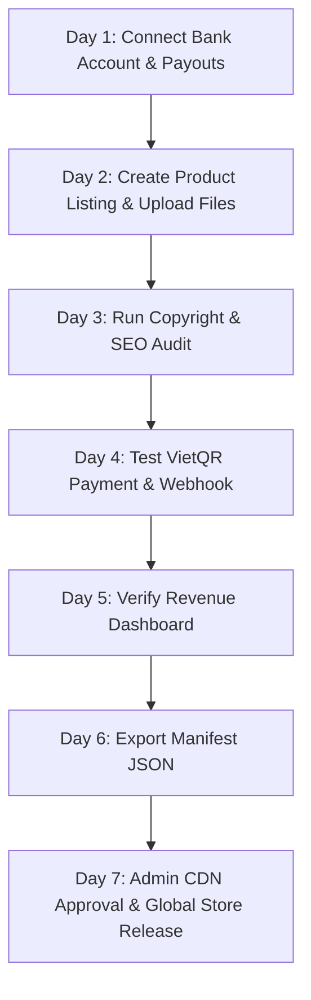

# 🚀 LumenForge Commercial Onboarding & Production Deployment Manual

This handbook serves as the official integration guide for launching the **LumenForge Commercial Onboarding** workflow, setting up live transactions, and transitioning from local development to cloud production.

---

## 🗺️ The 7-Day Commercial Onboarding Roadmap

LumenForge features a step-by-step launchpad that creators follow to get their store approved on the global CDN:



### Day-by-Day Onboarding Progress Actions

| Day | Action | Code Verification Key | Local Storage Sandbox Mode | Live Supabase Cloud Mode |
| :--- | :--- | :--- | :--- | :--- |
| **01** | **Connect Payout** | `lf_is_creator: true` | Saves bank credentials in browser session | Updates user profile `is_creator = true` |
| **02** | **Add Listing** | `lf_custom_products: [...]` | Stores temporary product draft locally | Inserts product row into `products` table |
| **03** | **Copyright & SEO Audit** | `lf_audit_passed: true` | Client-side visual scanning verification | Validates metadata parameters before publish |
| **04** | **VietQR Purchase Test** | `lf_creator_sales: [...]` | Generates simulator orders | Renders VietQR image dynamically via creator info |
| **05** | **Verify Revenue** | `lf_visited_dashboard: true` | Creates mock transaction histories | Fetches live transaction logs via `getMySales()` |
| **06** | **Download Manifest** | `lf_manifest_downloaded: true` | Downloads text file of JSON payload | Compiles manifest JSON package for registry |
| **07** | **Submit to Admin** | `lf_manifest_submitted: true` | Switches local status to `submitted` | Updates `products.status` to `submitted` |

---

## 💾 Production Database Initialization (`supabase_schema.sql`)

Run this SQL script in your **Supabase Project SQL Editor** to initialize live database tables and handle automatic creator profiling:

```sql
-- Enable UUID extension
create extension if not exists "uuid-ossp";

-- 1. PROFILES TABLE (linked to auth.users)
create table if not exists public.profiles (
    id uuid references auth.users on delete cascade primary key,
    name text not null,
    email text,
    avatar text,
    is_creator boolean default false,
    xp integer default 0,
    rank text default 'Novice',
    created_at timestamp with time zone default timezone('utc'::text, now()) not null,
    updated_at timestamp with time zone default timezone('utc'::text, now()) not null
);

-- Enable RLS for profiles
alter table public.profiles enable row level security;

create policy "Profiles are viewable by everyone" on public.profiles for select using (true);
create policy "Users can update their own profile" on public.profiles for update using (auth.uid() = id);

-- Trigger to automatically create profile on sign up
create or replace function public.handle_new_user()
returns trigger as $$
begin
    insert into public.profiles (id, name, email, avatar, xp, rank, is_creator)
    values (
        new.id,
        coalesce(new.raw_user_meta_data->>'name', split_part(new.email, '@', 1)),
        new.email,
        upper(substring(coalesce(new.raw_user_meta_data->>'name', split_part(new.email, '@', 1)) from 1 for 1)),
        0,
        'Novice',
        false
    );
    return new;
end;
$$ language plpgsql security definer;

create or replace trigger on_auth_user_created
    after insert on auth.users
    for each row execute procedure public.handle_new_user();

-- 2. PRODUCTS TABLE
create table if not exists public.products (
    id text primary key,
    name text not null,
    creator text not null,
    creator_email text not null,
    bank_name text not null,
    bank_account text not null,
    bank_owner text not null,
    momo_number text not null,
    type text not null, -- 'preset', 'lut', 'ebook'
    price numeric not null,
    original_price numeric,
    description text not null,
    cover_url text not null,
    file_link text not null,
    status text not null default 'draft', -- 'draft', 'testing', 'submitted', 'approved'
    creator_id uuid references public.profiles(id) on delete cascade not null,
    created_at timestamp with time zone default timezone('utc'::text, now()) not null
);

-- Enable RLS for products
alter table public.products enable row level security;

create policy "Approved products are viewable by everyone" on public.products for select using (status = 'approved');
create policy "Creators can view their own products in any state" on public.products for select using (auth.uid() = creator_id);
create policy "Creators can insert their own products" on public.products for insert with check (auth.uid() = creator_id);
create policy "Creators can update their own products" on public.products for update using (auth.uid() = creator_id);
create policy "Creators can delete their own products" on public.products for delete using (auth.uid() = creator_id);

-- 3. PURCHASES TABLE
create table if not exists public.purchases (
    id uuid default gen_random_uuid() primary key,
    user_id uuid references public.profiles(id) on delete cascade not null,
    product_id text not null,
    product_name text not null,
    product_type text not null,
    product_link text not null,
    price numeric not null,
    purchased_at timestamp with time zone default timezone('utc'::text, now()) not null
);

-- Enable RLS for purchases
alter table public.purchases enable row level security;
create policy "Users can view their own purchases" on public.purchases for select using (auth.uid() = user_id);
create policy "Service role bypasses RLS for inserting purchases" on public.purchases for insert with check (true);

-- 4. PENDING ORDERS TABLE
create table if not exists public.pending_orders (
    order_code numeric primary key,
    user_id uuid references public.profiles(id) on delete cascade not null,
    product_id text not null,
    product_name text not null,
    product_type text not null,
    product_link text not null,
    price numeric not null,
    status text default 'pending',
    created_at timestamp with time zone default timezone('utc'::text, now()) not null
);

-- Enable RLS for pending_orders
alter table public.pending_orders enable row level security;
create policy "Users can view their own pending orders" on public.pending_orders for select using (auth.uid() = user_id);
create policy "Service role can perform CRUD on pending orders" on public.pending_orders for all using (true);
```

---

## 💳 Checkout Gateways Configuration

LumenForge is equipped to support automated payment webhooks:

### Option A: PayOS (Automated VietQR Scan)
1. Integrates with the PayOS API using `@payos/node`.
2. Registers a webhook listener: `/api/payos-webhook` (Vercel) or `supabase/functions/payos-webhook` (Supabase).
3. Validates transactional checksums and fulfills purchases.

### Option B: Stripe (International Cards)
1. Redirects buyers to secure Stripe Checkout Sessions.
2. Webhook listener at `/api/stripe-webhook` (or Supabase equivalent) processes `checkout.session.completed` events.
3. Grants instant digital download access and updates XP/Badge status.

---

## 🛠️ Verification & Diagnostic Commands

Run these scripts locally to verify your deployment integrity before committing to production:

- **E2E Integration Flow Verification:**
  ```bash
  npm run test
  ```
- **PRO Membership Flow Verification:**
  ```bash
  npm run test:pro
  ```
- **Store Link Integrity Check:**
  ```bash
  npm run audit:links
  ```
- **SEO Elements Verification:**
  ```bash
  npm run audit:seo
  ```
- **Image & UI Accessibility Verification:**
  ```bash
  npm run audit:a11y
  ```
